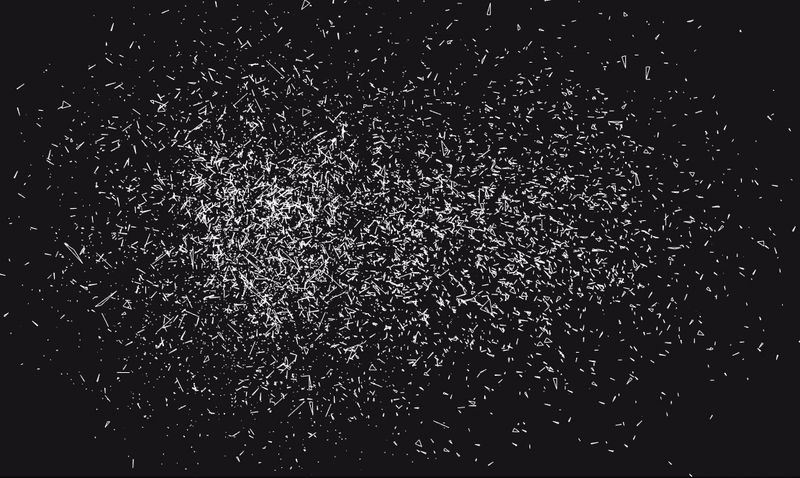

# svg-protect
Illustrator/Publsher proof your svgs before downloading.
=========

## Installation

  `npm install svg-protect`

## Usage
=========
    const svgp = require('svg-protect');

    var svg = document.getElementById('mysvg')

    svgp(svg,{
                  owner:"Dan Ellis <my_email@test.com>",
                  flatten:true,
                  elementids: "",
                  split:false,
                  cclicense:true,
                  cclogo:true,
                  savestyle: "svge" // "svge|svg|png"
                  savebtn:true
        })

#### Flatten - removes groups and adds all elements to base svg

#### Element IDS - overwrites element IDS

#### Split

Applies @mattdesl's triangle splitting of paths to svg,

#### cclicense - appends the creative commons lisence to svg as a comment.

#### savestyle, set save style from svge,svg,padding

#### savebtn, create a button you can click to save your work. id = savebtn
saving functions written with the help of the SVG Jimmy crowbar bookmarks: https://nytimes.github.io/svg-crowbar/

## Process
This program takes several steps to attempt to protect an svg. These are:

1. Flatten all group elements into main svg body.
2. Optimise svg code and convert all elements into Paths.
3. Rename all svg element ids to state ownership.   
4. Split paths into triangles.
5. Add CC Atrribution licence within svg comments.

## Contributing

In lieu of a formal style guide, take care to maintain the existing coding style. Add unit tests for any new or changed functionality. Lint and test your code.
